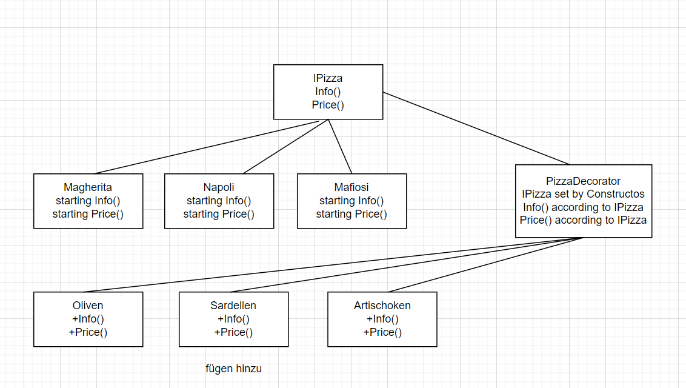

# Design Pattern

Erkläre das **Decorator Pattern** anhand eines Beispiels.

### Wofür?
Decorator is a structural pattern that allows adding new behaviors to objects dynamically by placing them inside special wrapper objects, called decorators.

##### Einfach gesagt: 
Mit Decoratorn kann man zur Laufzeit Funktionalitäten und Eigenschaften einer Klasse dynamisch erweitern.

## Beispiel:
### Step 1:
Als erstes braucht man ein Interfaces welches das "Was?" vorgibt also: Was soll dynamisch verändert werden?
```c#
interface IPizza {
  string Info();
  double Price();
}
```

### Step 2:
Das Interface an die gewünschten Klassen vererben. In unserem Fall sind das 3 verschiedene Pizza Sorten welche verschiedene Grundpreise bzw eine schiedene Grundinfos besitzen.

```c#
namespace Pizzas{
  class Margherita : IPizza{
    double price = 8.00;
    string info = "Margherita";

    public string Info(){
      return info;
    }
    public double Price(){
      return price;
    }
  }

  class Napoli : IPizza{
    double price = 9.50;
    string info = "Napoli";

    public string Info(){
      return info;
    }
    public double Price(){
      return price;
    }
  }

  class Mafiosi : IPizza{
    string info = "Mafiosi";
    double price = 9.80;

    public string Info(){
      return info;
    }
    public double Price(){
      return price;
    }
  }
}
```

### Step 3:
Nun erstellen wir verschiedene Decorator welche zum Ausgangspunkt (Grundpreis, Grundinfo) verschiedene Merkmale(Preis, Info) hinzufügen. Diese Decorator beziehen sich auf das Interface IPizza und somit können diese für alle Klassen welche das Interface vererbt bekommen haben benützt werden.
```c#
namespace Decorator{
  abstract class PizzaDecorator : IPizza{
    private IPizza pizza;

    public PizzaDecorator(IPizza pizz){
      pizza = pizz;
    }

    public virtual string Info(){
      return pizza.Info();
    }

    public virtual double Price(){
      return pizza.Price();
    }
  }

  class OlivenDecoratore : PizzaDecorator{
    public OlivenDecoratore(IPizza pizza) : base(pizza){}

    public override string Info(){
      return base.Info() + "+Oliven";
    }
    public override double Price(){
      return base.Price() + 0.50;
    }
  }

  class SardellenDecoratore : PizzaDecorator{
    public SardellenDecoratore(IPizza pizza) : base(pizza){}

    public override string Info(){
      return base.Info() + "+Sardellen";
    }
    public override double Price(){
      return base.Price() + 0.90;
    }
  }
  
  class ArtischokenDecoratore : PizzaDecorator{
    public ArtischokenDecoratore(IPizza pizza) : base(pizza){}

    public override string Info(){
      return base.Info() + "+Artischoken";
    }
    public override double Price(){
      return base.Price() + 0.70;
    }
  }
}
```

##### Code Anmerkung
Der generelle PizzaDecorator ist abstract damit man diese Klasse selbst nicht initialisieren kann. Die Funktionen der Klasse PizzaDecorator müssen virtual sein damit man sie in den folgenden Klassen überschrieben kann.

Das Keyword base() ruft immer den default Konstruktor der Vererbten Klasse auf.

### Step 4
Diese Decorator können nun belibig und verschachtelt egal ob ausgehend einer Magherita oder einer Napoli verwendet werden.

```c#
IPizza pizza = new Pizzas.Napoli();
    Console.WriteLine(new Decorator.OlivenDecoratore(new Decorator.OlivenDecoratore(new Decorator.ArtischokenDecoratore(pizza))).Price());

    Console.WriteLine(new Decorator.OlivenDecoratore(new Decorator.OlivenDecoratore(new Decorator.ArtischokenDecoratore(pizza))).Info());
```

##### Output
```sh
9.7
Margherita+Artischoken+Oliven+Oliven

11.2
Napoli+Artischoken+Oliven+Oliven
```

### Img
um das ganze besser zu verstehen hier noch eine Bild zur übersicht:

