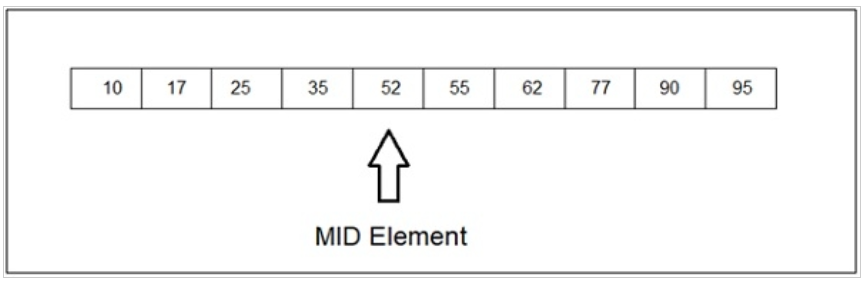
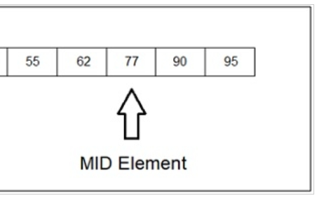
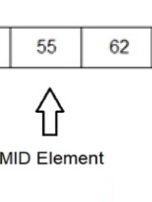
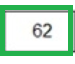
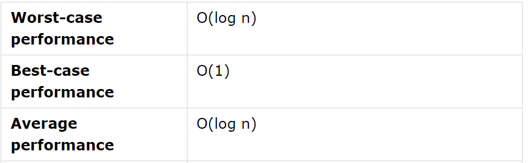

# Binäre Suche

Erkläre den Algorithmus der binären Suche. Verwende ein Beispiel. Betrachte die Performance Eigenschaften.

### Prinzip:
Die binäre Suche funktioniert in einem sortierten Array. Der Wert wird mit dem mittleren Element des Arrays verglichen. Wenn keine Gleichheit gefunden wird, wird der halbe Teil eliminiert, in dem der Wert nicht vorhanden ist. Auf die gleiche Weise wird die andere Hälfte durchsucht.

Hier ist das mittlere Element in unserem Array. Nehmen wir an, wir müssen 62 finden, dann wird der linke Teil eliminiert und der rechte Teil wird dann durchsucht.

### Ablauf:
Im Falle von 10 Elementen benötigt man im worst Case 4 Schritte.





### Laufzeit:


### Implementierung:
#### Iterativ:
```c#
public static int IterativeBinarySearch(int[] arr, int target)
    {
        int left = 0;
        int right = arr.Length - 1;

        while (left <= right)
        {
            int mid = left + (right - left) / 2;

            // Wenn das Element in der Mitte das Ziel ist, geben Sie den Index zurück
            if (arr[mid] == target)
            {
                return mid;
            }
            // Wenn das Element in der Mitte größer als das Ziel ist, suchen Sie im linken Teil weiter
            else if (arr[mid] > target)
            {
                right = mid - 1;
            }
            // Wenn das Element in der Mitte kleiner als das Ziel ist, suchen Sie im rechten Teil weiter
            else
            {
                left = mid + 1;
            }
        }

        // Rückgabe -1, wenn das Element nicht gefunden wurde
        return -1;
    }

```

#### Rekursiv:
```c#
public static int RecursiveBinarySearch(int[] arr, int target, int left, int right)
    {
        if (left <= right)
        {
            int mid = left + (right - left) / 2;

            // Wenn das Element in der Mitte das Ziel ist, geben Sie den Index zurück
            if (arr[mid] == target)
            {
                return mid;
            }
            // Wenn das Element in der Mitte größer als das Ziel ist, suchen Sie im linken Teil weiter
            else if (arr[mid] > target)
            {
                return RecursiveBinarySearch(arr, target, left, mid - 1);
            }
            // Wenn das Element in der Mitte kleiner als das Ziel ist, suchen Sie im rechten Teil weiter
            else
            {
                return RecursiveBinarySearch(arr, target, mid + 1, right);
            }
        }

        // Rückgabe -1, wenn das Element nicht gefunden wurde
        return -1;
    }
```

### Code Anmerkung
Generell such man immer mit ```int mid = left + (right - left) / 2;``` die Mitte. Diese wird mit dem gesuchten Wert verglichen. Daraus folgen 3 Fälle:

- Die Mitte des Arrays ist die gesuchte Zahl oder Element -> fertig
- Die Zahl in der Mitte ist größer, dann muss man sich den linken Teil also "left bis mid-1" weiter anschauen
- Die Zahl in der Mitte ist kleiner, dann muss man sich den linken Teil also "mid+1 bis right" weiter anschauen

so geht man immer weiter vor bis man die gewünschte Zahl oder das gewünschte Element gefunden hat.