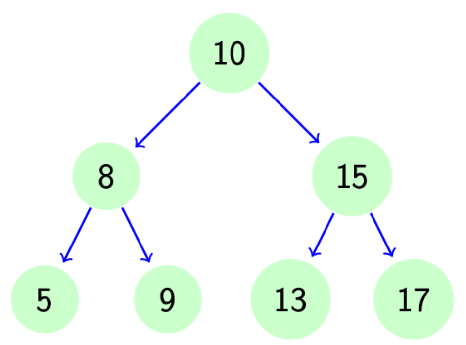

# Binärbaum

Erkläre wie ein binärer Suchbaum funktioniert. Was sind die Performance Eigenschaften? Wie werden grundlegende Operationen (Suchen, Einfügen und Löschen) implementiert.

### Was ist ein Binärbaum?
Ein binärer Baum ist eine Datenstruktur, die aus Knoten besteht, die jeweils höchstens zwei Kinder haben können: einen linken und einen rechten Nachfolger. Jeder Knoten in einem binären Baum enthält eine Schlüsselwert oder ein Element sowie Verweise auf seine beiden Kinder. Die Struktur eines binären Baumes ermöglicht effiziente Such-, Einfüge- und Löschoperationen, insbesondere wenn der Baum balanciert ist. Die Höhe eines binären Baumes wird durch die maximale Anzahl von Kanten zwischen der Wurzel und einem Blatt gemessen und kann die Effizienz der Operationen beeinflussen.



### Implementierung:
#### Aufbau eines Binärbaumes:
```c#
class Node{
  public int key;
  public Node left;
  public Node right;

  public Node(int k){
    key = k;
  }
}


class Tree {
  Node root;
  public Tree(Node root) {
    this.root = root;
  }

  public void Insert(Node n){}
  public void Delete(Node n){}
  public Node Search(int n){}
      
}  
```
Hier erstellen wir die generelle Datenstruktur für einen BinaryTree. In der Klasse Node gibt es immer einen Key sowie Nachfolge Node (left,right) zu beginn sind diese immer null.

#### Einfügen
```c#
public void Insert(Node n){
  Node run = root;
  if(root == null){root = n; return;}
  while(true){
    if(n.key > run.key){
      if(run.right == null){
        run.right = n;
        break;
      }
      run = run.right;

    }else{
      if(n.key < run.key){
        if(run.left == null){
          run.left = n;
          break;
        }
        run = run.left;
      }else{
        Console.WriteLine("Bereits vorhanden!!");
        return;
      }
    }
  }
}
```
Wichtig ist hier zu verstehen, dass im Normalfall keine gleichen Werte ein einem Binärbaum exestieren sollten.

Prinzip:
- einzufügender Wert ist größer wie aktueller -> geh nach rechts im Baum
- - Rechter Platz ist leer, dann kommt dort der einzufügende Wert hin.
- - Rechter Platz ist nicht frei, dann startet man wieder von vorne ob dieser Wert größer oder kleiner ist
- einzufügender Wert ist kleiner wie aktueller -> geh nach links im Baum
- - Linker Platz ist leer, dann kommt dort der einzufügende Wert hin.
- - Linker Platz ist nicht frei, dann startet man wieder von vorne ob dieser Wert größer oder kleiner ist.

#### Suchen

```c#
public Node search(int k){
    Node run = root;
    while(true){
      if(run.key == k){
        return run;
      }else{
        if(run.key < k){
          if(run.right == null){
            return null;
          }else{
            run = run.right;
          }
        }else{   
            if(run.left == null){
              return null;
            }else{
              run = run.left;
            }
        }
      }
    }
  }
```
Prinzip und Vorgangsweise ist sehr ähnlich zum Einfügen

#### Rekursiv Suchen und Einfügen
Da man beim Aufruf der Funktion den Ausgangsknoten root nicht kennt benötigt man eine Helper Funktion welche die eigentliche rekursive Methode aufruft.

```c#
public Node SRhelper(int k){
    return searchRek(root, k);
  }
  
public Node searchRek(Node parent, int k){
  if(parent.key == k){
    return parent;
  }
  if(parent.key < k){
    if(parent.right == null){
      return null;
    }else{
      return searchRek(parent.right, k);
    }
  }else{
    if(parent.left == null){
      return null;
    }else{
      return searchRek(parent.left, k);
    }
  }
}

public Node IShelper(int k){
    return insertRek(root, k);
  }

public void insertRek(Node Parent,int k){
  if(Parent.key < k){
    if(Parent.right == null){
      Parent.right = new Node(k);
    }else{
      insertRek(Parent.right, k);
    }
  }else{
    if(Parent.left == null){
      Parent.left = new Node(k);
    }else{
      insertRek(Parent.left, k);
    }
  }
}
```

Da die Denkweise hinter dieser rekursiven Implementierung genau die selbe ist wie bei der iterative werde ich das hier nicht weiter erläutern. Siehe ../thema4/rekursion-allgemein 

#### Löschen
Löschen ist etwas komplexer, zumindest das Löschen wenn der zu löschende Knoten 2 Nachfolger hat

```c#
public void Delete(int k){
    Node n = search(k);
    Node parent = searchParent(n);
    
    if(n == null){return;}
    
    // n hat keinen Nachfolger einfach vom Parent trennen
    if(n.left == null && n.right == null){
      if(parent == null){ // root Sonderfall
        Console.WriteLine("Der letzte exestierende Konten kann nicht gelöscht werden"); 
        return;
      }else{
        if(parent.left == n){
          parent.left = null;
        }else{
          parent.right = null;
        }
      }
    }

    // n hat nur einen linken Nachfolger, diesen hochschieben
    if(n.left != null && n.right == null){
      if(parent == null){ // root Snoderfall
        root = n.left;
      }else{
        if(parent.left == n){
          parent.left = n.left;
        }else{
          parent.right = n.left;
        }
      }
    }

    // n hat nur einen rechten Nachfolger, diesen hochschieben
    if(n.left == null && n.right != null){
      if(parent == null){ //root Sonderfall
        root = n.right;
      }else{
        if(parent.left == n){
          parent.left = n.right;
        }else{
          parent.right = n.right;
        }
      }
    }

    // n hat zwei Nachfolger
    Node smallestright = findsmalestRight(n.right);
    Node parentofsmallest = searchParent(smallestright);

    if(parentofsmallest.left == smallestright){
      parentofsmallest.left = smallestright.right;
    }
    if(parentofsmallest.right == smallestright){
      parentofsmallest.right = smallestright.right;
    }

    if(parent == null){ // root Sonderfall
      root = smallestright;
      smallestright.left = n.left;
      smallestright.right = n.right;
    }else{

      if(parent.left == n){
        parent.left = smallestright;
        smallestright.left = n.left;
        smallestright.right = n.right;
      }

      if(parent.right == n){
        parent.right = smallestright;
        smallestright.left = n.left;
        smallestright.right = n.right;
      }
    }
  }

public Node findsmalestRight(Node n){
  Node current = n;
  while(current.left != null){
    current = current.left;
  }
  return current;
}

public Node searchParent(Node d) {
  Node run = root;
  Node parent = null;

  while (run != null) {
      if (run.key == d.key) {
          return parent;
      } else if (d.key < run.key) {
          parent = run;
          run = run.left;
      } else {
          parent = run;
          run = run.right;
      }
  }
  return null;
}
```

Beim Löschen mit 2 Nachfolgern sucht man den kleinsten Knoten der rechten Seite und schiebt diesen an die Position des zu löschenden Knoten

### Laufzeiten
#### Einfügen
- Minimaler Aufwand ist O(1): Der Baum ist zu einer Liste entartet und es wir ein zweites Kind zur Wurzel hinzugefügt.

- Maximaler Aufwand ist O(n): Der Baum ist zu einer Liste entartet und es wir ein Kind zum Blatt hinzugefügt.

- Mittler Aufwand ist O(log2 n): Der Baum relativ ausbalanciert. Dann hat er bei n Knoten die Tiefe von O(log2 n).

#### Suchen
- Minimaler Aufwand ist O(1): Das gesuchte Element ist die Wurzel

- Maximaler Aufwand ist O(n): Der Baum ist zu einer Liste entartet und das gesuchte Element ist am Ende der Liste.

- Mittler Aufwand ist O(log2 n): Der Baum relativ ausbalanciert. Dann findet man den Knoten im Schnitt bei O(log2 n)

