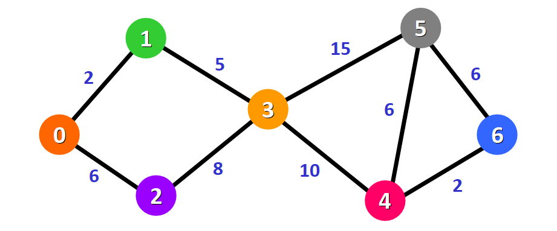

# Dijkstra Shortest Path

Erkläre den Anwendungsfall und die Funktionsweise des Dijkstra Shortest Path Algorithmus. Verwende ein Beispiel.


----

## Graph
Um zu verstehen für was der Dijkstra Shortest Path Algorithmus gut ist muss man erstmal verstehen was ein Graph ist.

Ein graph ist eine Datenstruktur die mehreren Knoten/Vertizen die mit Edges mit einander verbunden sind. 

Ein Vertex kann beliebig viele Edges, sprich Verbindungen zu anderen Vertizes, enthalten.
Zusätzlich kann ein Vertex noch Daten enthalten.
```C#
public class Node
{
    public string Value { get; }
    public List<Edge> Adjacent { get; }

    public Node(string value)
    {
        Value = value;
        Adjacent = new List<Edge>();
    }
}

```
Eine Edge ist immer eine Verbindung von genau **zwei** Vertizes. 
Außerdem kann ein weightest Graph noch ein **Gewicht/Weight** enthalten. Dieser Wert sagt wie aufwändig oder auch lang dieser Weg ist.
```c#
public class Edge
{
    public Node FromNode { get; }
    public Node ToNode { get; }
    public int Weight { get; }

    public Edge(Node fromNode, Node toNode, int weight)
    {
        FromNode = fromNode;
        ToNode = toNode;
        Weight = weight;
    }
}

Ein Graph beinhaltet nun eine Liste oder ein Dictionary von Vertizes welche jeweils untereinander Edges haben.
```c#
public class Graph
{
    private Dictionary<string, Node> nodes;

    public Graph()
    {
        nodes = new Dictionary<string, Node>();
    }
```


## Vertex und Edge hinzufügen
```c#
    public void AddNode(string value)
    {
        # Schauen ob es schon Node mit dem Wert gibt.
        if (!nodes.ContainsKey(value))
        {
            ## Noten erstellen der bis auf weiteres frei ohne Verbindung im Dictionary besteht
            nodes[value] = new Node(value);
        }
    }

    public void AddEdge(string fromValue, string toValue, int weight)
    {
        ## Schauen ob von beide Knoten jeweils schon einer mit so einem Wert wie im Parameter von AddEdge im Dictionary existiert. Wenn nicht: erstellen.
        if (!nodes.ContainsKey(fromValue))
            AddNode(fromValue);
        if (!nodes.ContainsKey(toValue))
            AddNode(toValue);
        
         // Edge vom Startknoten zum Zielknoten erstellen
         Edge newEdge = new Edge(nodes[fromValue], nodes[toValue], weight);
        // Edge zur Adjazenzliste des Startknotens hinzufügen
        nodes[fromValue].Adjacent.Add(newEdge);
    }
```

hier muss man zwischen einen gerichteten und einen ungerichteten Graph unterscheiden. Bei einem ungerichteten müsste man vom zielKnoten zurück zum startKnoten auch noch eine Edge hinzufügen

Ein fertiger Graph mit Vertizes, Edges und die Weights von dem einzelnen Edges könnte nun so aussehen:

## Dijkstra Shortest Path mit Prirority Queue
Es gibt nun mehrere Pfade von einem Knoten zu einem anderen. Diese sind nicht alle gleich lang. Erstens kann man über mehrere Edges gehen. Andererseits sind die Edges selbst ja jeweils gewichtet und dadurch unterschiedlich aufwändig.

**Erklärung:**

Distanzen und Prioritätswarteschlange:
- Ein Dictionary distances speichert die kürzeste bekannte Distanz von startValue zu jedem anderen Knoten.
- Eine PriorityQueue wird verwendet, um Knoten basierend auf ihrer aktuellen kürzesten Distanz zu verarbeiten. Knoten mit der geringsten Distanz werden zuerst bearbeitet.

Verarbeitung der Knoten:
- In der Schleife wird der Knoten mit der geringsten Distanz aus der Warteschlange geholt und dessen benachbarte Knoten aktualisiert.
- Wenn die Distanz über einen benachbarten Knoten verbessert werden kann, wird die neue Distanz im Dictionary gespeichert und der Knoten in die Prioritätswarteschlange mit der aktualisierten Distanz wieder eingefügt.

```c#
        // Initialisierung
        var distances = new Dictionary<string, int>();
        var priorityQueue = new PriorityQueue<string, int>();
        var processed = new HashSet<string>();
```
wenn der Knoten verarbeitet wurde wird er sein Wert zu dem processed Set hinzugefügt dass man ihn sich nochmal ansieht.

Als erstes setzt man die distanzen. Die startValue hat von sich selbst die Distanz. Die anderen Knoten haben vorerst int.MaxValue was unendlich repräsentiert.

Dann wird die erste start Value zur priority Queue hinzugefügt. 
```c#
   // Initialisierung der Distanzen
        foreach (var node in nodes)
        {
            distances[node.Key] = int.MaxValue;
        }
        distances[startValue] = 0;
        priorityQueue.Enqueue(startValue, 0);
```

**Funktionen der PriorityQueue in Dijkstras Algorithmus:**

1. Effizientes Entfernen des Knotens mit der geringsten Distanz:
    - Die Hauptfunktion der PriorityQueue im Kontext von Dijkstras Algorithmus ist das effiziente Entfernen des Knotens mit der derzeit geringsten Distanz zum Startknoten. Dies gewährleistet, dass der Algorithmus immer den "nächstbesten" Knoten bearbeitet, um die kürzesten Pfade zu finden.

2. Dynamisches Aktualisieren der Distanzen:
    - Wenn die Distanz eines Knotens aufgrund der Entdeckung eines kürzeren Pfades aktualisiert wird, wird dieser Knoten mit seiner neuen, verbesserten Distanz zurück in die PriorityQueue eingefügt. In einigen Implementierungen könnte dies bedeuten, dass Knoten mehrfach in der Warteschlange vorkommen können, jeweils mit unterschiedlichen Distanzen.

3. Verwaltung der Knoten zur Verarbeitung:
    - Die PriorityQueue hilft bei der Verwaltung der Knoten, die noch verarbeitet werden müssen. Durch die Prioritätswartung (Knoten mit geringerer Distanz haben eine höhere Priorität) stellt sie sicher, dass die Verarbeitung in der effizientest möglichen Reihenfolge erfolgt.

Nun wenn man erstmal den startKnoten bei Initalisierung mit 0 (Distanz von sich selbst )hinzugefügt hat zur Queue. Startet man eine While Schleife die solange läuft bis die PriorityQueue keine Elemente mehr hat.

```c#
    while (priorityQueue.Count > 0)
        {
            // Entferne den Knoten mit der geringsten Distanz
            var current = priorityQueue.Dequeue();
            processed.Add(current);

            // Bearbeite jeden Nachbarknoten
            foreach (var edge in nodes[current].Adjacent)
            {
                var neighbor = edge.ToNode.Value;
                if (processed.Contains(neighbor))
                    continue;

                // Berechne neue Distanz
                var newDistance = distances[current] + edge.Weight;
                if (newDistance < distances[neighbor])
                {
                    distances[neighbor] = newDistance;
                    priorityQueue.Enqueue(neighbor, newDistance);
                }
            }
        }
```
1. Als erstes wird sich der Vertex mit der geringsten Distanz von der Queue geholt. 
2. Dann fügt man ihn zum processed set hinzu damit man weiß man hat ihn schon angeschaut
3. Jetzt berarbeitet man jeden Nachbarknoten von current indem man durch die Edges vom momentanigen Vertex iteriert.
    1. Wert vom Nachbarknoten holen
    2. Schauen ob der Nachbarknoten schon verarbeitet wurde indem man ihn im set sucht (ja: continue)
    3. Wenn der Knoten noch nicht verarbeitet wurde rechnet man sich die distanz aus
     das ist die Distanz vom start Vertex zu `current` + das Weight also die Distanz von current zu dem Neighbor den man sich gerade anschaut. Diese Information holt man sich aus der edge
    4. Wenn nun neue Distanz kleiner als die alte ist (wenn der Pfad noch nicht gefunden wurde ist die alte Distanz immer unendlich also die neue auch einfach kleiner) wird:
        1. distances von momentanigen neighbor auf die neue Distanz gesetzt
        2 der neighbor in die Priroty queue mit der neuen Distanz hinzugefügt

