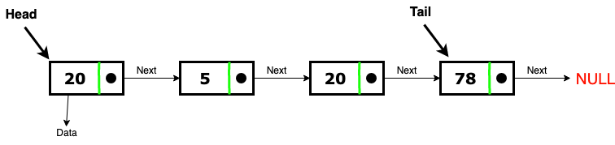
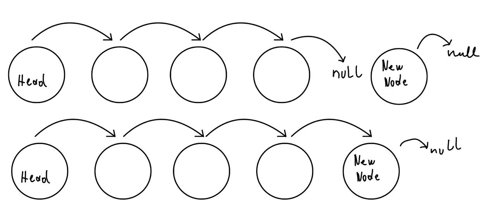
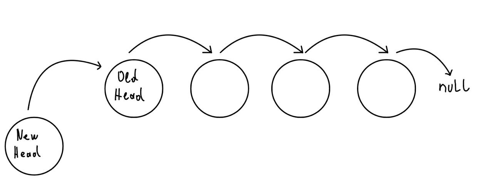
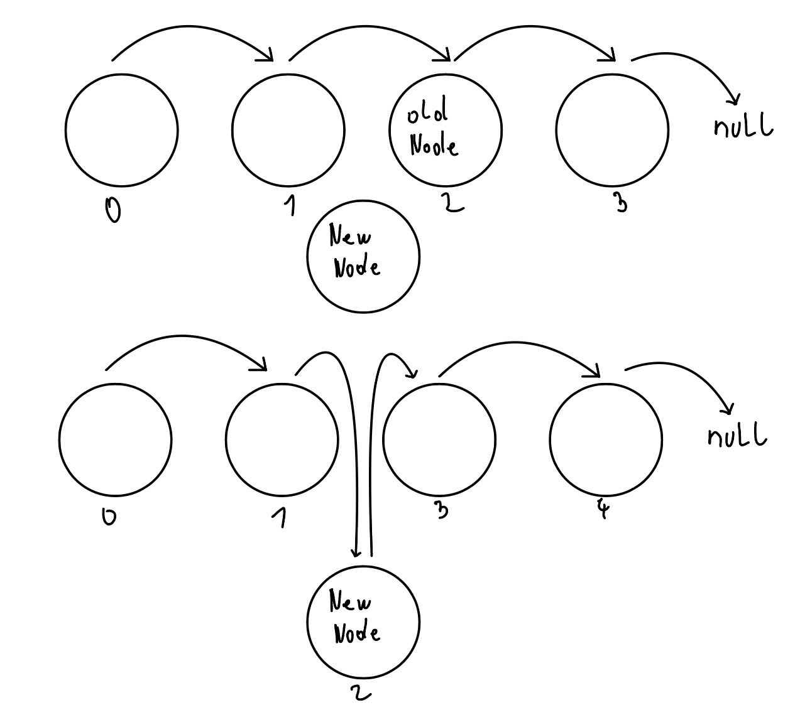
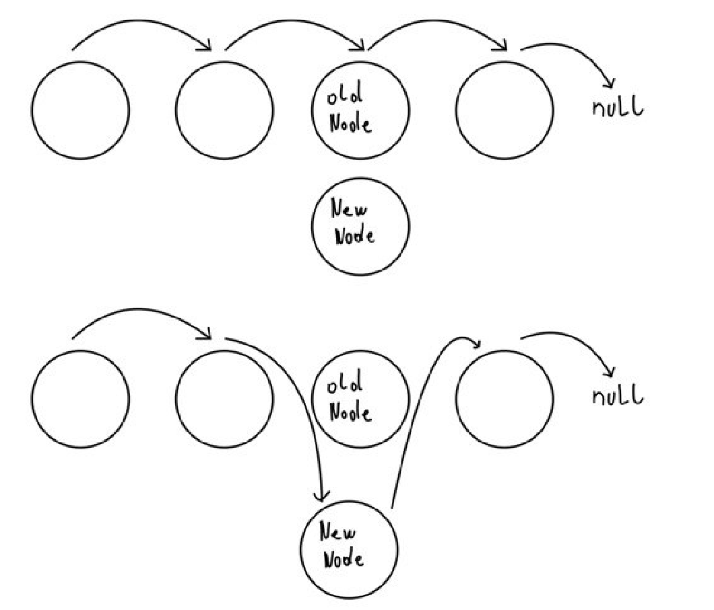

# Verkettete Liste 

Erkläre das Funktionsprinzip einer einfach verketteten Liste. Wie werden grundlegende Operationen (Suchen, Einfügen und Löschen) implementiert? Was sind die Performance Eigenschaften?


## Einfach verkettete Listen - Erklärung
Einfach verkettete Listen sind eine Datenstruktur, von einzelnen Knoten die alle miteinander mit Zeigern verbunden sind. 

Ein Knoten einer einfach verketteten Listen ist folgendermaßen aufgebaut.
- Datenfeld
- Zeiger auf den nachfolgenden Knoten (Node).


Wenn man diese Knoten verkettet entsteht eine Liste die folgendermaßen aussehen kann:


Hierbei gibt es zwei Knoten welche Sonderfälle sind:

- Head
    - Erster Knoten am Anfang
    - Wenn der Headknoten `null` ist, ist die Liste leer
    - wenn man keiner andere Zeiger auf einzelne Elemente hat oder suchen muss geht man meistens vom Head also start aus
- Tail
    - letzter Knoten in einer Linked list der noch immer Daten hält
    - zeigt mit pNext immer auf `null`, das signalisiert das Ende der Liste


### Implementierung

Wenn man eine einfach verkettete Datenstruktur in einer OOP basierten Sprache wie Java oder C# zum implementieren will fängt man als erstes mit dem Knoten an
```java
class Node{
  char data;
  Node next;

  public Node(char c){
    data = c;
    next = null;
  }
}
```

Die Liste selbst kann dann eine extra klasse sein die als Property, die referenz auf den start pointer enthält und bei grundsätzlich bei Datenoperationen auch von diesem Punkt ausgeht

standardmäßig ist die Liste leer und daher ist der head am anfang immer null

```java
class List{
  Node head = null;

```

### Das N. Element in einer Liste suchen
Um das N. Element einer Liste zu suchen geht man folgendermaßen vor:

- beim start (head) anfangen
- mal auf das nächsten Knoten springen bis man bei n angeokommen ist
- vorm weiterspringen prüfen ob das momentanige element `null` ist -> liste hat weniger als N elemente.

Diese Methode heißt in vielen Implementationen `get(n)` und kann in Java etwa wie folgt aussehen:
```java
	public Node get(int k) {
		Node current = head;

		for (int i = 0; i < k; i++) {
			if (current == null) {
				return null;
			}
			current = current.next;
		}
		return current;
	}
```


Das Datenfeld kann einen beliebigen Datentyp haben. Zum Beispiel auch ein Zeiger auf eine andere Datenstruktur. 

### Knoten an das Ende ranhängen (append)
Hier muss man eigentlich nur bis zum Schluss fahren. Da der neue Knoten zum Tail wird, muss er auf `null` zeigen. Der alte Tail zeigt jetzt auf dem neuen Knoten.




```Java
 public void append(Node newNode){
    newNode.next = null; // neuer Tail muss auf null zeigen

    if(start == null){   
      // Sonderfall: Liste ist Leer ->  Node wird neuer Head
      head = newNode;
      return;
    }
    // letzten Knoten am ende finden
    Node current;
    current = start;
    while(current.next != null){
      current = current.next;
    }
    current.next = newNode; // alter Tail zeigt auf neuen Tail statt auf null
  }
```


### Einen Knoten vorne einfügen (prepend)
Um einen Knoten ganz vorne einzufügen, muss die `next` referenz vom neuen Knoten auf den alten Head zeigen.

Anschließend setzt man das Head property von der List Klasse auf den neuen Knoten.



In Java kann eine implementierung folgednermaßen aussehen:

```java
public void prepend(Node newNode) {
		newNode.next = start;
		start = newNode;
	}
```

### Einen knoten an der Stelle k einfügen (insert)
Um den Knoten an der stelle K einzufügen kann man folgendermaßen vorgehen:

- Knoten von der stelle `k-1` suchen
- `next` Referenz von jenem Knoten auf den neuen knoten setzen
- `next` Referenz von eingefügten Knoten auf Knoten der vorher an der Stelle k war setzen.




Hie muss man auch den Sonderfall k=0 abfangen.
```java
 public void insert(int k, Node newNode){

    if(k == 0){
      // Sonderfall k=0, vorne ranhängen
      prepend(newNode);
      return;
    }
    Node prevk = get(k-1);

    newNode.next = prevk.next;

    prevk.next = newNode;
  }
```


### Einen Knoten mit einem anderen ersetzen (set)
Um einen Knoten mit einem anderen zu ersetzen geht man folgendermaßen vor:

- Referenz auf dem Knoten holen der **vor** dem zu ersetzenden Knoten kommt
    - `next` Referenz von jenem Knoten auf den neuen knoten setzen
- Referenz Knoten der **nach** dem zu ersetzendem Knoten kommt holen
    - `next` Referenz auf Knoten der nach dem alten knoten kam setzen



Um den k. Knoten mit einem anderen zu ersetzen, kann man in Java implementierten `get` methode folgendermaßen umsetzen:

```java
  public void set(int k, Node newNode){
    if(start == null){
      return;
    }
    if(k == 0){
      newNode.next = start.next;
      start = newNode;
      return;
    }
    Node prevk = get(k-1);

    newNode.next = prevk.next.next;
    prevk.next = newNode;
  }
```
Hier gibt es noch zu beachten dass man den Sonderfall dass man, den ersten Knoten (k=0) ersetzen, will abprüfen muss.


## Performance - Vergleich mit Array
Während (dynamisches) Array, einen Speicher allokiert hat, wobei alle elemente direkt im Speicher aneinader stehen und mit einem offset vom startpointer des arrays auf einzelne Elemente zugegriffen wird, sind linked lists etwas anders aufgebaut.

Bei linked lists ist es egal wo ein Knoten im speicher allokiert ist weil alles mit Zeigern funktioniert.

Die Zugriffszeit von 
Bei der Bewertung der Performance von Arrays und verketteten Listen in Bezug auf die grundlegenden Operationen wie Suchen, Einfügen und Löschen ist es hilfreich, die Big O-Notation zu verwenden, um ihre Effizienz zu vergleichen. Die Big O-Notation gibt die obere Grenze der Laufzeitkomplexität einer Operation an, bietet also eine Einschätzung, wie gut oder schlecht eine Operation im schlimmsten Fall skaliert, wenn die Größe der Datenstruktur zunimmt.

## Arrays

- **Zugriff (direkt auf ein Element zugreifen):** O(1)
  - Da Arrays einen direkten Zugriff über Indizes erlauben, ist der Zugriff auf ein beliebiges Element konstant.
- **Suchen (nach einem Wert suchen):** O(n)
  - Um ein Element zu finden, muss möglicherweise das gesamte Array durchlaufen werden.
- **Einfügen (am Ende):** O(1) (durchschnittlich, wenn genügend Platz allokiert ist)
  - Bei dynamischen Arrays kann es notwendig sein, das Array zu vergrößern und Elemente zu kopieren, was O(n) kostet.
- **Einfügen (an einer beliebigen Stelle):** O(n)
  - Elemente müssen verschoben werden, um Platz zu machen.
- **Löschen (am Ende):** O(1)
- **Löschen (an einer beliebigen Stelle):** O(n)
  - Ähnlich wie beim Einfügen müssen Elemente verschoben werden, um Lücken zu schließen.

## Verkettete Listen

- **Zugriff:** O(n)
  - Um ein bestimmtes Element zu erreichen, muss möglicherweise die gesamte Liste durchlaufen werden.
- **Suchen:** O(n)
  - Es muss möglicherweise jeder Knoten überprüft werden, um den gesuchten Wert zu finden.
- **Einfügen (am Anfang):** O(1)
  - Einfach den neuen Knoten am Anfang hinzufügen.
- **Einfügen (nach einem bestimmten Knoten):** O(1), vorausgesetzt, der Vorgängerknoten ist bekannt.
- **Einfügen (am Ende ohne Kenntnis des letzten Knotens):** O(n), da die Liste durchlaufen werden muss, um das Ende zu finden.
- **Löschen (am Anfang):** O(1)
- **Löschen (nach einem bestimmten Knoten):** O(1), vorausgesetzt, der Vorgängerknoten ist bekannt.
- **Löschen (am Ende ohne Kenntnis des letzten Knotens):** O(n), um das vorletzte Element zu finden.

## Zusammenfassung
Verkettete Listen sind flexibler bei Einfüge- und Löschoperationen, besonders am Anfang der Liste oder wenn der Vorgänger eines zu manipulierenden Knotens bekannt ist. Sie haben jedoch einen Overhead durch zusätzlichen Speicherbedarf für Zeiger und schlechtere Cache-Effizienz.


