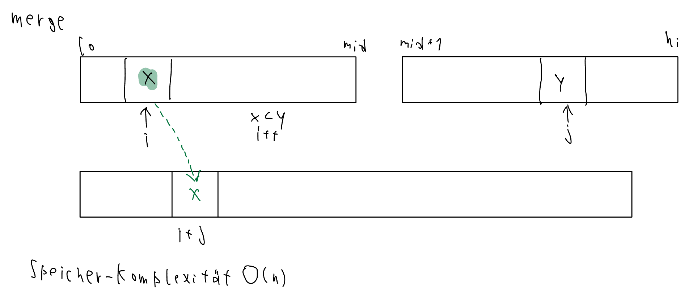
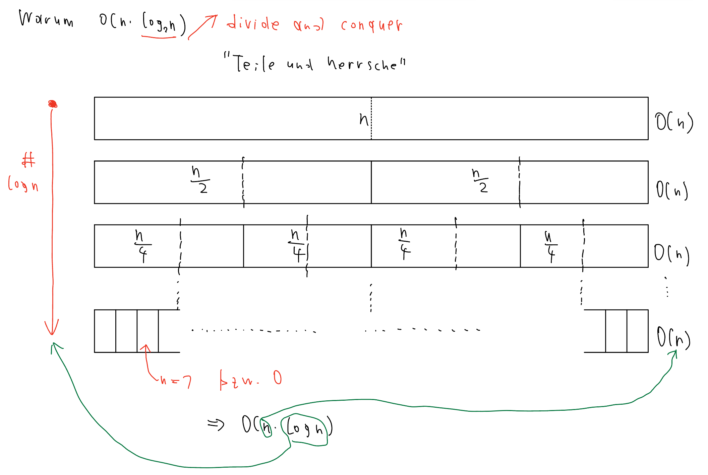

# Mergesort

Erkläre Funktionsweise und Performance Eigenschaften des Sortierverfahrens **Mergesort**.

Fragen:
Warum braucht man mehr Speicher? (Weil zum zusammenfügen immer Speicher allokiert werden muss)
Warum ist die Laufzeit O(n*log(n))? (n ist das zusammenfügen, log(n) das Aufteilen)
Code rekursiv erklären!

Mergesort ist ein effizienter divide-and-conquer Algorithmus welcher darauf basiert zwei sortierte 
Arrays zusammenzufügen. Der Algorithmus ist, durch seine Zeitkomplexität von O (n * log(n)), 
besonders bei großen Datenmengen nützlich.

Für diesen Algorithmus muss zuerst eine Methode erstellt werden, welche ein integer Array als 
Argument übergeben bekommt. Diese Methode soll dann das Array in zwei kleinere Arrays aufteilen, 
diese sortieren und dann wieder zusammenfügen. Die Methode soll solange teilen bis das Array eine 
Größe von 1 hat.

Beispiel:

```C# 
msort(a,0,a.Length-1)

void msort(int[] a, int lo, int hi)
{
    if(hi<=lo) {
        return;
    }
    int mid = (lo+hi)/2;
        msort(a,lo,mid);
        msort(a,mid+1,hi);
        merge(a,lo,mid,hi);
}
```



Nach dem Aufteilen des Arrays wird es mithilfe der Funktion „merge“ wieder zusammengefügt und 
dabei sortiert. Es werden die einzelnen Einträge in den Arrays verglichen, hierbei wird der kleinere in 
das größere Array eingefügt, in welchem die beiden kleineren Arrays gemerged werden sollen.

Dieser Prozess wiederholt sich so lange, bis alle Arrays in ein einzelnes großes array gemerged 
wurden.

Mergesort benötigt viel Speicher, da es sich in Arrays mit einer größe von 1 aufteilt, zusätzlich muss 
ein Array der Größe n (n ist die Anzahl an Elementen in den zu vergleichenden und - mergenden 
Arrays) erstellt werden um die sortierten Elemente aus den gemergeden Arrays 
zwischenzuspeichern. Dieses Array wird dann als input array verwendet und mit dem nächsten 
aufgeteilten Array gemerged.

