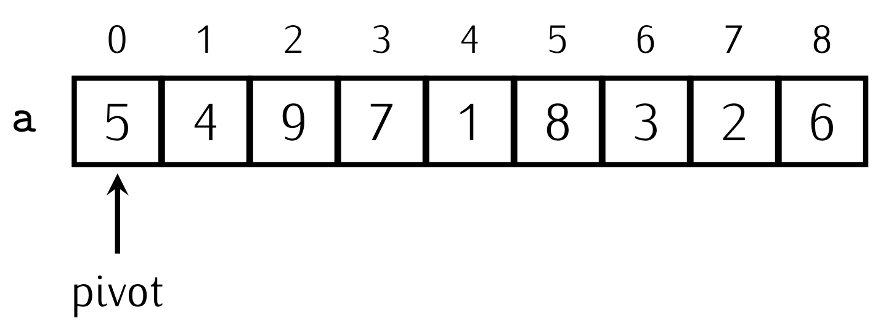
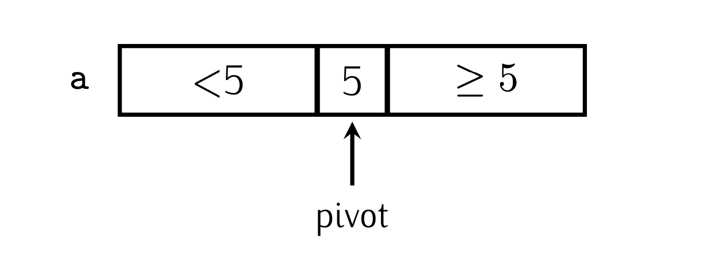
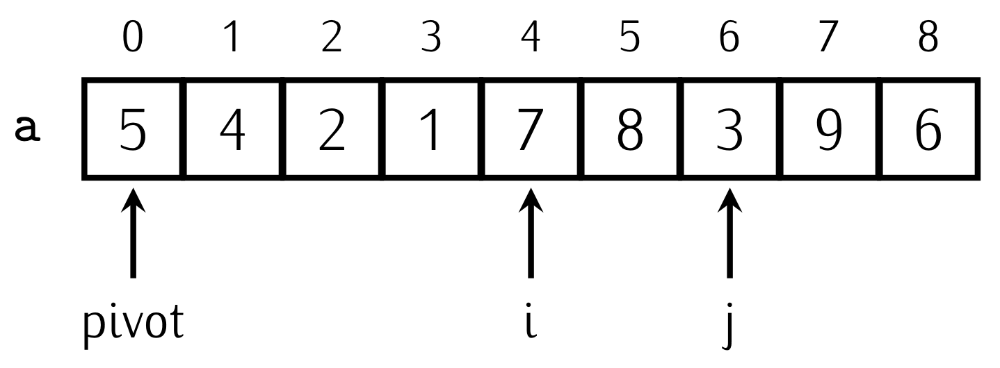
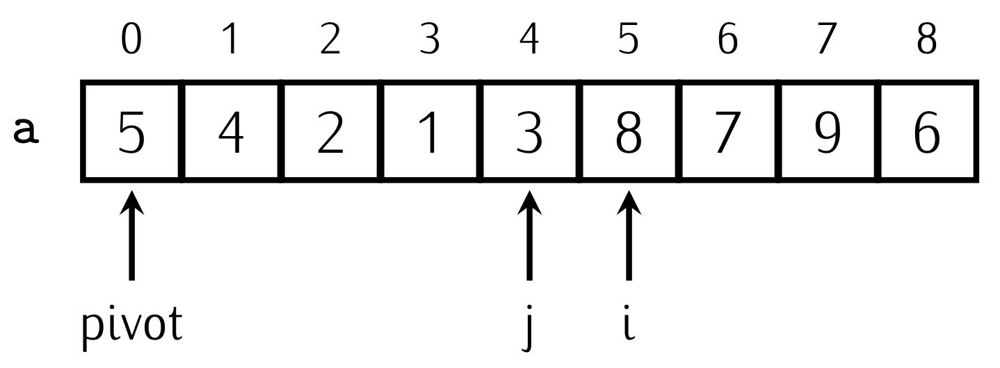
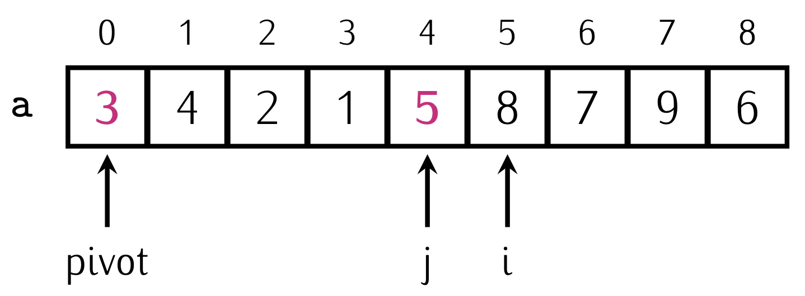

# Quicksort

Erkläre Funktionsweise und Performance Eigenschaften des Sortierverfahrens **Quicksort**.

---

## Erklärung

Die Idee des Quick Sort Algorithmus ist dass man als erstes ein Element (z.B. das Erste Element nimmt)



Dann werden alle Elemente die kleiner als das pivot sind vor dem Pivot geschoben und die größeren nach dem Pivot.


## Nicht In-Place Implementierung (nicht wie in Schule aber leichter verständlich)

Die Out Place Implementierung ist leicht verständlich und kann so aussehen.

```python
def partition(arr):
    pivot = arr[len(arr) // 2]
    left = []
    middle = []
    right = []

    for x in arr:
        if x < pivot:
            left.append(x)
        elif x == pivot:
            middle.append(x)
        else:
            right.append(x)

    return left, middle, right

def quick_sort(arr):
    if len(arr) <= 1:
        return arr

    left, middle, right = partition(arr)
    left = quick_sort(left)
    right = quick_sort(right)

    return left + middle + right
```

Es wird also ein pivot genommen. In dem Fall in der Mitte. Es wird für jeden Fall ein neues array gemacht:

- Kleiner als das Pivot:
  - in die right list
- größer als das pivot:
  - in die left list nach dem array
- das Pivot kommt in die mitte dazwischen

Diese drei arrays werden nun extra rekursiv abgearbeitet.

## Performance

Man erkennt also dass sich in **jedem rekurisvem Schritt die Anzahl der zu sortierenden Elemente halbiert**.

Man kann sich auch denken die Funktion wird so oft rekursiv aufgerufen wie man die Length des Arrays durch 2 Teilen kann bis man 1 hat.

- das ist der Zweilogarithmus weil von n. Weil das gegenteil wäre ja n (array.length) mal 2 multiplizieren also 2^n
- pro schritt muss man schlimmstenfalls n Elemente prüfen

**Daher kommt man auf die big O notation O(n \* log n)**

## In-Place Quick Sort wie in der Schule

Jetzt muss für die obige Implementierung, für jeden Schritt drei arrays allokieren und dann wieder eines wenn man diese in der rekursion wie wieder zusammenbringt.
Man kann aber auch mit alles mit Array-Mutation ändern (im ursprünglichen array arbeiten und kein sortiertes zurückgeben)

Die Rekursion hier in C# macht das verständlicher:

```c#
 public static void qsort(int[] a, int lo, int hi)
	 {
		  if (hi > lo)
		  {
				int pivot = partition(a, lo, hi);
				qsort(a, lo, pivot - 1);
				qsort(a, pivot + 1, hi);
		  }
	 }
```

Es wird also jedes mal das array gegeben und ein `hi` und `lo`. Das sind die Indizes von dem ersten in dem letzten Element was sich angeschaut werden soll. Zurückgegeben wird der Index vom pivot mit dem dieser Call der partitions funktion gearbeitet hat.

Der Ablauf der Partition funktion ist folgedner:

- pivot wählen (anfang)
  - wenn pivot nicht am anfang: pivot mit ersten element `lo` tauschen
- zwei lauf variablen (in diesem fall i, j) nehmen.
  - `i = lo`
  - `j = hi`

```c#
var pivot = a[lo];
int i = lo+1;
int j = hi;
int temp;
```

- jetzt macht man für beide lauf variablen jeweils eine for schleife
  - `j` läuft gegen `lo` also `j--`
  - `i` läuft gegen `hi` also `i++`
- beide dieser for schleifen schauen sich das momentanige element an
  - wenn `j` kleiner als pivot stop
  - wenn `i` größer als pivot stop

```c#
while (i <= hi && a[i] < pivot)
{
	i++;
}

while (j > lo && a[j] > pivot)
{
	j--;
}
```

wenn man zwei elemente gefunden hatte die "auf der jeweils falschen seite sind" tauscht man sie.

```c#
temp = a[i];
a[i] = a[j];
a[j] = temp;
```



Das ganze wird wiederholt man bis sich die beiden Indizes überschneiden.


```c#
while (true)
{
	// ... two while loops for j, i

  // checking for if loops is finished
	if (i >= j){
		break;
	}

  // ... switching elements at i and j

}
```

Zuletzt tauscht man das pivot mit wieder mit dem element an j (das letzte/nach tauschen erste element kleiner als pivot). Zum Schluss hat man außerdem

```c#
temp = a[lo];
a[lo] = a[j];
a[j] = temp;
return j;
```



Hier eine volle implementation der partition funktion zusammen mit der rekursion in C#

```c#
 public static void qsort(int[] a, int lo, int hi)
	 {
		  if (hi > lo)
		  {
				int pivot = partition(a, lo, hi);
				qsort(a, lo, pivot - 1);
				qsort(a, pivot + 1, hi);
		  }
	 }
	public static int partition(int[] a, int lo, int hi){
		var pivot = a[lo];
		int i = lo+1;
		int j = hi;
		int temp;
		while (true)
		 {
			  while (i <= hi && a[i] < pivot)
			  {
					i++;
			  }

			  while (j > lo && a[j] > pivot)
			  {
					j--;
			  }

			  if (i >= j){
				  break;
			  }
			  temp = a[i];
			  a[i] = a[j];
			  a[j] = temp;
		 }
		temp = a[lo];
		a[lo] = a[j];
		a[j] = temp;
		return j;
	}
```
