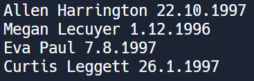

# CSV Daten in Objekte einlesen (Bearbeiten, Sortieren)

Gegeben ist eine CSV Datei die nach folgendem Schema aufgebaut ist:

```
 first;last;birth
 Allen;Harrington;22.10.1997
 Megan;Lecuyer;01.12.1996
 Eva;Paul;07.08.1997
 Curtis;Leggett;26.01.1997
```

Aufgabenstellung:

- Erkläre wie diese Daten in einem Programm eingelesen und gespeichert werden könnten. Verwende eine sinnvolle und übersichtliche Zerlegung in Objekte/Klassen.
- Zeige die Implementierung.
- Es soll die älteste Person in dieser Liste gefunden werden. Wie ist dies zu realisieren?
- Zeige die Implementierung.


&nbsp;

---

&nbsp;

### Daten einlesen und speichern

Die Daten werden idealerweise mithilfe von zwei Klassen ausgelesen bzw. gespeichert.
Klasse Person: beinhaltet Vorname und Nachname
Klasse Birthdate: enthält das Geburtsdatum aufgeteilt in Tag, Monat und Jahr

In der Klasse Person befindet sich dabei ein Objekt der Klasse Birthdate.


Zum auslesen der Daten wird ein Streamreader verwendet, der Zeile für Zeile das CSV Dokument einliest. Nachdem alle Daten aus einer Zeile eingelesen und in Variablen gespeichert wurden, wird damit ein neues Objekt der Klasse Person angelegt, die dann in eine List gespeichert wird. Durch die Methode .Split(";") können die einzelnen Zeilen voneinander unterschieden und getrennt werden. 

**Implementierung: Lesen und Speichern von CSV Daten**


		
```cs
using System;
using System.Collections.Generic;
using System.IO;
    
class Birthdate {
    public int day;
    public int month;
    public int year;
    
    public Birthdate(int day, int month, int year){
    	this.day=day;
    	this.month=month;
    	this.year=year;
    }
} 
    
class Person {
    public string firstname;
    public string lastname;
    public Birthdate birth;
    
    public Person(string firstname,string lastname, int day, int month, int year){
    	this.firstname = firstname;
    	this.lastname = lastname;
    	this.birth = new Birthdate(day,month,year);
    }
}
    
    
    
class Program
{
    public static void Main(string[] args)
    {
    	readCSV("test.csv");
    		
    	// Ausgabe der Personen				
    	foreach (Person p in readCSV("test.csv")){
    	    Console.WriteLine(p.firstname+" "+p.lastname+" "+p.birth.day+"."+p.birth.month+"."+p.birth.year);
    	}			
    }
    
    
    public static List<Person> readCSV(string filePath)
    {
    	List<Person> people = new List<Person>();
    
    	// first;last;birth ignorieren
    	bool ignoreFirstLine = true;
    
    	using (StreamReader reader = new StreamReader(filePath))
    	{
    		string line;
    		while ((line = reader.ReadLine()) != null)
    		{
    			if(ignoreFirstLine){
    			    ignoreFirstLine = false;
    			    continue;
    			}else{
                            string[] row = line.Split(';');
                            string first = row[0];
                            string last = row[1];
                            string birth = row[2];
                
                            String[] birthSplit = birth.Split('.');
                            int day = int.Parse(birthSplit[0]);
                            int month = int.Parse(birthSplit[1]);
                            int year = int.Parse(birthSplit[2]);
                            Person p = new Person(first, last, day, month, year);
                            people.Add(p);
    		        }
    	        }
        }
    		
        return people;
    }
}
```

&nbsp;
**Ausgabe im Terminal:**



---
