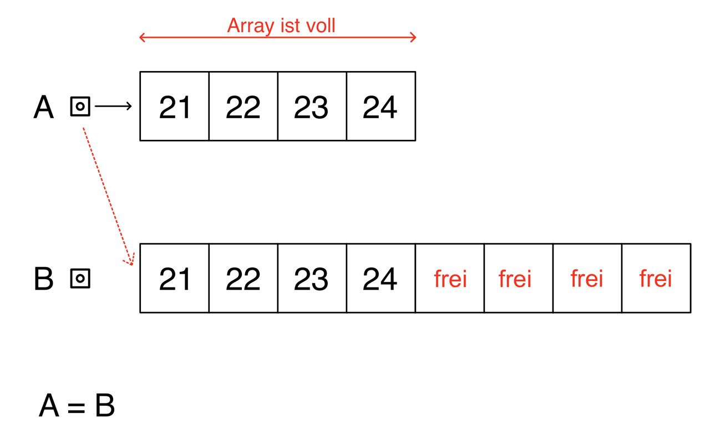
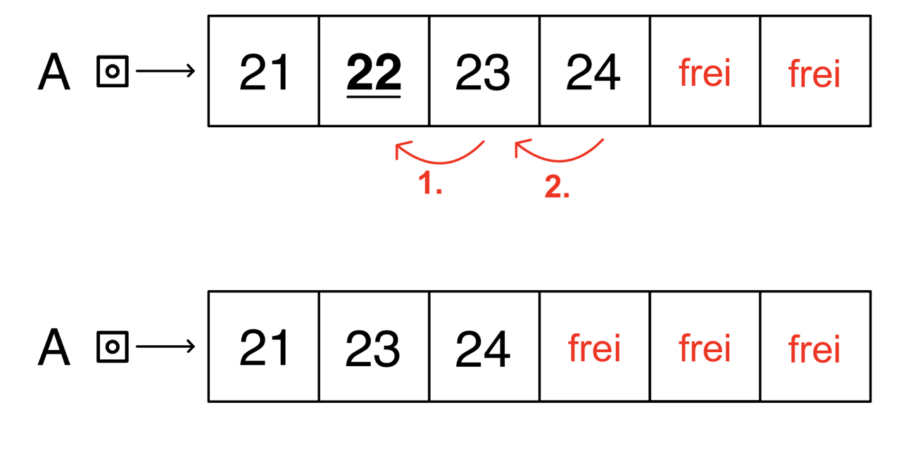
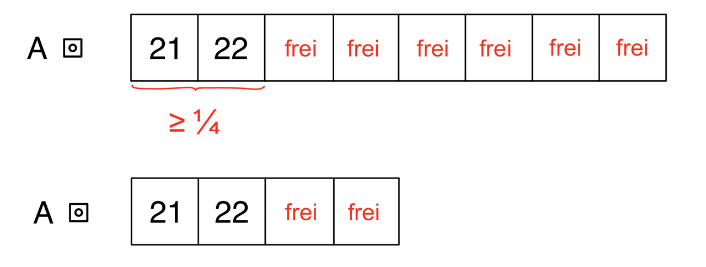
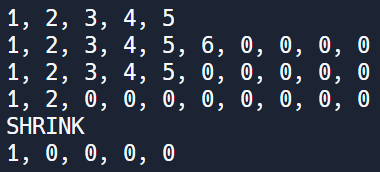

# Dynamisches Array

Angelehnt an die Funktionalität von List soll eine Klasse DynArray für ein dynamisches Array aus
int erstellt werden. Wähle einen Algorithmus der die Anzahl der notwendigen new Operationen
minimiert.

 - Erkläre das Prinzip eines dynamischen Arrays. 
 - Vergleiche die Performance mit einer verketteten Liste. 
 - Implementiere die Klasse und
   die Methoden:
   
  – add(int n) – Einfügen am Ende    
  – add(int i, int n)  – Einfügen an Index i. Alle Elemente ab i werden verschoben.  
  – remove(int i) – Entfernt das Element an der Stelle i. Alle Element nach i rücken um 1 auf.


## Prinzip eines dynamischen Arrays

**Was ist ein dynamisches Array?**
Ein dynamisches Array funktioniert ähnlich wie ein normales Array, jedoch mit dem Unterschied, dass es seine Größe während der Laufzeit anpassen kann. Das heißt, das Array kann nach Bedarf schrumpfen aber auch wachsen.

**Prinzip:**
Das Prinzip eines dynamischen Arrays besteht darin, dass zunächst ein kleines Array mit einer bestimmten Startgröße angelegt wird. Wenn dieses Array voll ist und ein neues Element hinzugefügt werden soll, wird ein neues, größeres Array erstellt (oft die doppelte Größe des vorherigen Arrays). Die vorhandenen Elemente werden in das neue Array kopiert. 

&nbsp;
#### Beispiele
**Einfügen, wenn das Array voll ist:**

Wenn das Array voll ist, aber trotzdem ein Element eingefügt werden soll, werden die Elemente in ein größeres Array umkopiert. Am Ende wird der Pointer auf das neue Array gesetz.




---


**Löschen eines Elements an bestimmten Index:**

Wenn ein Element gelöscht werden soll, werden nacheinander die Elemente eine Stelle nach links verschoben. So wird der frei gewordene Platz mit den daneben liegenden Werten aufgefüllt. Da es ein Element weniger gibt, wird die vorherige letze Stelle frei.



---


**Größenanpassung (resize):**

Wenn das Array nur zu einem Viertel oder weniger gefüllt ist, wird zur Speicheroptimierung das Array verkleinert. Dazu wird das Array in ein neues, kleineres Array kopiert und schrumpft so z.B auf die halbe Größe.



---

## Performancevergleich

**Lesen:**

| Dynamisches Array | verkettete Liste | 
|----------|----------|
| O(1)   | O(n)   | 

*dynamisches Array:*
direkter Zugriff auf Elemente mithilfe des Index  

*verkettete Liste:*
sequenzieller Durchlauf notwendig  

&nbsp;
**Einfügen**

| Stelle | Dynamisches Array | verkettete Liste | 
|----------|----------|----------|
| Anfang   | O(n)   | O(1)   |
| Ende   | O(1)   | O(1)   |
| Mitte   | O(n)   | O(n)   |

*dynamisches Array:*
Element muss möglicherweise umkopiert werden

*verkettete Liste:* 
nur der nächste Zeiger muss verändert werden

&nbsp;
**Löschen**

| Stelle | Dynamisches Array | verkettete Liste | 
|----------|----------|----------|
| Anfang   | O(n)   | O(1)   |
| Ende   | O(1)   | O(n)   |
| Mitte   | O(n)   | O(n)   |

*dynamisches Array:*
Element muss möglicherweise umkopiert werden

*verkettete Liste:* 
nur der nächste Zeiger muss verändert werden oder
bis zum letzten Element durchlaufen, um den Zeiger zu verändern

---

## Implementierung

```cs

using System;

class DynArray
{
    public int[] array;
    public int size; // Anzahl der Elemente im Array --> i


    public DynArray()
    {
        array = new int[5];
        size = 0;
    }

    // Einfügen am Ende
    public void add(int n)
    {
	// Array voll?
        if (size == array.Length)
        {
            resizeArray();
        }
        array[size] = n;
	size++;
    }
	
    // Einfügen am Index i
    public void add(int i, int n)
    {
        if (i < 0 || i > size)
        {
            Console.WriteLine("Index is not valid!");
        }

        if (size == array.Length)
        {
            resizeArray();
        }
	
	Array.Copy(array, i, array, i + 1, size - i);
	array[i] = n;
	size++;
    }


    // Methode zum Entfernen eines Elements an einem bestimmten Index
    public void remove(int i)
    {
        if (i < 0 || i >= size)
        {
	    Console.WriteLine("Index is not valid!");
        }

	// Array um 1 nach links verschieben, letzte Stelle auf 0 setzen
	Array.Copy(array, i + 1, array, i, size - i - 1);
	array[size - 1]=0;
	size--;

	// Prüfen, ob Array weniger als 1/4 voll ist
	if (size < array.Length / 4)
	{
	    shrinkArray();
	}
    }


    // Array vergrößern
    public void resizeArray()
    {
	int newSize = array.Length * 2; 
	int[] newArray = new int[newSize];
	Array.Copy(array, newArray, size);
	array = newArray;
    }

    // Array verkleinern
    public void shrinkArray()
    {
        Console.WriteLine("SHRINK");
	int newSize = array.Length /2; 
	int[] newArray = new int[newSize];
	Array.Copy(array, newArray, size);
	array = newArray;
    }
}


class Program
{
    public static void Main(String[] args)
    {
        DynArray dynArr = new DynArray();

        dynArr.add(0,1);
	dynArr.add(1,2);
	dynArr.add(3);
	dynArr.add(4);
	dynArr.add(5);
	Console.WriteLine(String.Join(", ", dynArr.array));
	dynArr.add(6);
	Console.WriteLine(String.Join(", ", dynArr.array));

	dynArr.remove(5);
	Console.WriteLine(String.Join(", ", dynArr.array));
	dynArr.remove(4);
	dynArr.remove(3);
	dynArr.remove(2);
	Console.WriteLine(String.Join(", ", dynArr.array));
	dynArr.remove(1);
	Console.WriteLine(String.Join(", ", dynArr.array));				
    }
}


```

&nbsp;
**Ausgabe im Terminal:**


