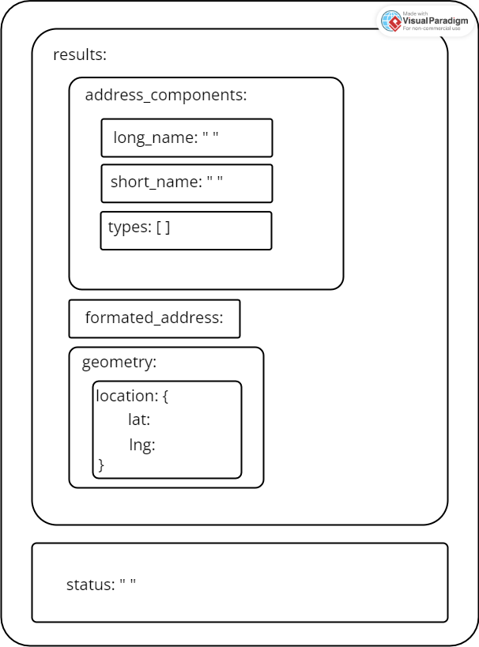

# JSON

Erkläre das JSON Datenformat. Wie können JSON Daten in einem C# Programm eingelesen werden?

Über den Google geocode Webservice soll ermittelt werden in welchem Land sich eine Stadt befindet. Der JSON Response sieht wie folgt aus. Implementiere ein C# Programm das die Aufgabenstellung löst.

```
{
	 "results" : [
			{
				"address_components" : [
					{
						"long_name" : "Toronto",
						"short_name" : "Toronto",
						"types" : [ "locality", "political" ]
					},
					{
						"long_name" : "Toronto Division",
						"short_name" : "Toronto Division",
						"types" : [ "administrative_area_level_2", "political" ]
					},
					{
						"long_name" : "Ontario",
						"short_name" : "ON",
						"types" : [ "administrative_area_level_1", "political" ]
					},
					{
						"long_name" : "Canada",
						"short_name" : "CA",
						"types" : [ "country", "political" ]
					}
				 ],
				 "formatted_address" : "Toronto, ON, Canada",
				 "geometry" : {
						"location" : {
							 "lat" : 46.452469,
							 "lng" : -63.379967
						}
				 }
			}
	 ],
	 "status" : "OK"
}
```
---
## JSON Datenformat

JSON (JavaScript Object Notation) ist ein Datenformat, das hauptsächlich für den Datenaustausch zwischen Anwendungen verwendet wird. Es ist einfach zu lesen und zu schreiben, sowohl für Menschen als auch für Maschinen.

JSON-Daten werden in Schlüssel/Wert-Paaren geschrieben. Schlüssel und Wert werden durch einen Doppelpunkt in der Mitte getrennt, wobei sich der Schlüssel links und der Wert rechts befindet. Unterschiedliche Schlüssel/Wert-Paare werden durch ein Komma (,) getrennt. Arrays werden mit eckigen Klammern ([ ]) dargestellt. Elemente innerhalb von Arrays werden mit einem Komma getrennt.

## Implementierung

**Visualiserung:**


&nbsp;

**Code:**

```cs
using System;
using System.IO;
using System.Collections.Generic;
using System.Text.Json;

/* note: 
Für diese Aufgabe wurden nur die benötigten Klassen implementiert; 
Unten befindet sich die vollständige Umsetzung,
um auf alle Informationen zugreifen zu können
*/

public class AddressComponent
{
   public string long_name { get; set; }
   public string short_name { get; set; }
   public List<string> types { get; set; }
}


public class Result
{
   public List<AddressComponent> address_components { get; set; }
}


public class Response
{
   public List<Result> results { get; set; }
}

class Program
{
   public static void Main(string[] args)
   {
      string dataJson = File.ReadAllText("geolocation.json");

      Response response = JsonSerializer.Deserialize<Response>(dataJson);

      string country = "";
      string city = "";
      
      foreach(Result result in response.results)
      {
         foreach(AddressComponent addressComponent in result.address_components)
         {
            if(addressComponent.types.Contains("locality"))
            {
                  city = addressComponent.long_name;
            }

            if(addressComponent.types.Contains("country"))
            {
                  country = addressComponent.long_name;
            }
         }

            /*
            // 2. Möglichkeit
            string[] splitAddress = result.formatted_address.Split(',');
	    city = splitAddress[0];
	    country = splitAddress[splitAddress.Length - 1];
            */
      }

      Console.WriteLine("Country: "+country+"\nCity:"+city);
   }
}

```
---

**Vollständige Implementierung aller Klassen:**

```cs
public class AddressComponent
{
   public string long_name { get; set; }
   public string short_name { get; set; }
   public List<string> types { get; set; }
}


public class Location
{
   public double lat { get; set; }
   public double lng { get; set; }
}


public class Geometry
{
   public Location location { get; set; }
}


public class Result
{
   public List<AddressComponent> address_components { get; set; }
   public string formatted_address { get; set; }
   public Geometry geometry { get; set; }
}


public class Response
{
   public List<Result> results { get; set; }
   public string status { get; set; }
}

//...
```
---

Fragen: Alternative zu JSON? --> XML
